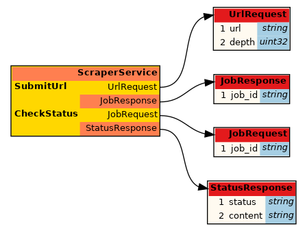
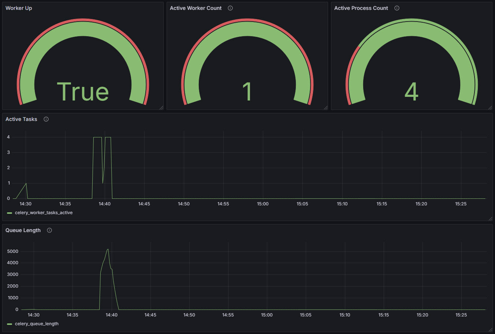
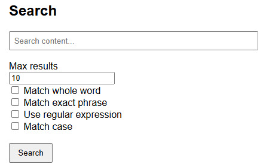

# Distributed Web Scraper

DataSpider is a distributed web scraping platform designed to extract, process, and search web content asynchronously. It uses gRPC for task submission, Celery for asynchronous task processing, and Elasticsearch for indexing scraped content. The frontend provides a simple UI to submit jobs, check their status, and search across previously scraped content with highlighted results rendered safely in sand-boxed `iframes`. The system supports configurable crawl depth, allowing it to recursively follow internal links up to a specified depth, enabling deep content discovery within target sites.

## System Architecture

Here is the project structure:

```text
├── grpc_server
│   ├── Dockerfile
│   ├── proto
│   │   └── scraper.proto
│   └── server.py
├── celery_worker
│   ├── Dockerfile
│   └── tasks.py
├── frontend
│   ├── Dockerfile
│   ├── app.py
│   ├── proto
│   │   └── scraper.proto
│   ├── static
│   │   └── styles.css
│   └── templates
│       └── index.html
├── celery_exporter
│   ├── Dockerfile
├── docker-compose.yml
```

The docker-compose.yml file orchestrates the entire system, defining services for the gRPC server, Celery worker, frontend UI, Redis (for Celery’s message broker), and Elasticsearch (for indexing and searching content).

### gRPC Server

The grpc_server folder hosts the backend gRPC service, `ScraperService`, which defines two primary methods:

- `SubmitUrl` for submitting URLs to be scraped
- `CheckStatus` for querying job status



These methods are specified in the `scraper.proto` protocol buffer file. The `server.py` script implements the service logic, including task delegation to Celery workers for asynchronous processing. Python gRPC bindings are generated during the Docker build process, and the server listens for incoming RPC requests on port 50051.

### Celery Worker

Celery is a distributed `task queue` system that enables asynchronous execution of time-consuming or parallelizable tasks using worker processes. It is widely used for background job processing in web applications, supporting various messaging brokers like Redis or RabbitMQ to queue and dispatch tasks. It allows developers to scale workloads across multiple machines or containers, improving responsiveness and throughput.

Upon startup, the worker connects to a Redis message broker and listens for incoming tasks. It is configured with a concurrency level of 4 (number of logical CPUs) using the prefork model, where the main process forks four child processes in advance to handle tasks concurrently. Prefork is Celery's default and most robust execution pool, offering strong performance and isolation, especially for CPU-bound or blocking operations. Note that Celery successfully detected and registered all the defined tasks.

```text
 -------------- celery@celery_worker v5.5.2 (immunity)
--- ***** -----
-- ******* ---- Linux-6.8.0-1020-raspi-aarch64-with-glibc2.35 2025-05-01 21:25:29
- *** --- * ---
- ** ---------- [config]
- ** ---------- .> app:         scraper:0xffff886fd330
- ** ---------- .> transport:   redis://redis_db_spider:6379/0
- ** ---------- .> results:     redis://redis_db_spider:6379/0
- *** --- * --- .> concurrency: 4 (prefork)
-- ******* ---- .> task events: OFF (enable -E to monitor tasks in this worker)
--- ***** -----
 -------------- [queues]
                .> celery           exchange=celery(direct) key=celery

[tasks]
  . tasks.crawl_finished
  . tasks.process_scraped_links
  . tasks.scrape_url
  . tasks.start_crawl

[2025-05-01 21:25:29,904: INFO/MainProcess] Connected to redis://redis_db_spider:6379/0
[2025-05-01 21:25:29,912: INFO/MainProcess] mingle: searching for neighbors
[2025-05-01 21:25:30,935: INFO/MainProcess] mingle: all alone
[2025-05-01 21:25:30,950: INFO/MainProcess] celery@celery_worker ready.
```

The accompanying Dockerfile creates a self-contained environment with all necessary dependencies, allowing the worker to run efficiently in parallel across distributed containers.

### Frontend

The frontend directory implements the web-based user interface for interacting with the scraper system. Developed using Flask, the app.py script manages user input, URL submission, job status retrieval, and search functionality. It securely renders scraped content using sand-boxed `iframes` to isolate untrusted HTML.

To facilitate seamless communication with the gRPC backend, the proto/ subdirectory contains a shared copy of the `scraper.proto` file. This ensures consistent message formats between the gRPC server and client components, allowing the frontend to invoke backend services reliably via gRPC calls.

### Celery Exporter

The celery_exporter folder includes a custom Dockerfile that builds a telemetry exporter for Celery, based on the open-source project [celery-exporter](https://github.com/danihodovic/celery-exporter). Designed for Prometheus integration, this exporter collects and exposes real-time Celery task metrics - such as execution counts, states, and latencies - via an HTTP endpoint on port 9808. This service enables robust observability and monitoring of Celery workloads within containerized environments.

I configured Telegraf on the host to collect metrics from the Celery Prometheus exporter and store them in InfluxDB. These metrics are then visualized using Grafana for real-time monitoring and analysis of Celery task performance and worker health. The telemetry data indicates that a single Celery worker instance is running, configured with a concurrency level of four, resulting in four active worker processes.



## Crawling Depth

Crawling depth refers to how many layers of internal links a web scraper follows beyond the initial page. A depth of 1 means only the starting URL is scraped, while higher depths allow the scraper to explore and extract content from pages linked within the site, recursively. This is particularly useful for sites with nested structures - such as blogs, documentation, or e-commerce categories - where relevant data may reside several clicks away from the homepage. The system supports a configurable crawl depth, enabling users to control how deep the scraper should traverse, balancing content coverage with performance and resource usage.

#### High-Depth Crawling Challenges

As crawl depth increases, the number of pages visited can grow exponentially, especially on websites with dense internal linking. For example, a depth of 3 might mean hundreds or thousands of pages are visited if each page links to dozens of others. This surge in HTTP requests can quickly consume system resources - CPU, memory, and bandwidth - especially when scraping concurrently. It may also overload the target website's server, leading to slow responses or dropped connections.

Many websites implement anti-scraping measures such as rate limiting, IP bans, CAPTCHAs, or user-agent filtering. When a scraper sends too many requests in a short time - particularly at higher crawl depths - it increases the likelihood of detection. The site may respond with HTTP 429 (Too Many Requests), temporary blocks, or even permanent bans for specific IP addresses or user agents. This not only disrupts data collection but may also violate the site's terms of service. Hence, exercise caution when configuring a high crawl depth for a website

#### High-Depth Crawling Resources

The Scrapy community has provided two well-known sandbox websites for testing and demonstrating web scraping capabilities in a safe and controlled environment. [Quotes to Scrape](http://quotes.toscrape.com/) presents paginated quotes along with links to author detail pages, offering a practical scenario for implementing and validating multi-level crawling logic. [Books to Scrape](http://books.toscrape.com) mimics a real e-commerce bookstore and features structured product listings, category hierarchies, and deep navigation - making it ideal for testing recursive scraping, content extraction, and indexing workflows.

Wikipedia offers publicly available database [dumps](https://dumps.wikimedia.org/) that can be downloaded and used to set up a local test instance of the encyclopedia. These dumps include the full content of Wikipedia articles, metadata, and revision history, enabling developers and researchers to work with large-scale, real-world text data in a controlled environment. Hosting a local instance is particularly useful for offline analysis, building custom search engines, or testing scraping and data processing tools without affecting the live Wikipedia site.

Kiwix lets you host and view compressed `.zim` Wikipedia dumps offline. Change to the kiwix directory, and download the full version ZIM file that includes all articles, with images and media. It is best for complete offline access, but largest in size.

```bash
cd kiwix
wget wget -P ./zim_data https://dumps.wikimedia.org/other/kiwix/zim/wikipedia/wikipedia_en_simple_all_maxi_2024-06.zim
```

Build and run the kiwix container:

```bash
docker compose up --build
```

You can now access the Wikipedia files locally from:

    http://localhost:8081

## Celery Tasks

This project defines the following Celery tasks within the celery_worker service:

- tasks.start_crawl
- tasks.scrape_url
- tasks.process_scraped_links
- tasks.crawl_finished

`start_crawl` is the entry-point task that initiates a new web scraping job. It receives a root URL and crawl depth, orchestrates the scraping process by generating initial `scrape_url` tasks, and links them using a Celery chord with `process_scraped_links` as the callback. It ensures that the crawl is traceable by assigning a unique `batch_id`. The gRPC server triggers `start_crawl` task dynamically using the `send_task` method, enabling decoupled execution without hardcoding task imports.

```python
job = celery_app.send_task("tasks.start_crawl", args=[request.url, request.depth])
```

Each `scrape_url` task is responsible for retrieving a web page, parsing its content to extract both clean text and full HTML, and identifying internal links for further traversal. To avoid redundant visits to the same URL, a Redis-backed set is used to track already-scraped links. Parsed data is indexed into Elasticsearch to enable efficient full-text search, filtering, and result highlighting.

`crawl_finished` is the final callback task that runs when all recursive crawling and link processing is complete. It can log crawl summary, update metadata in the database, notify external services (e.g., via webhook), or mark the crawl job as "completed" in a tracking system.

## Getting Started

Clone the repository and go into the project root directory:

```bash
cd DataSpider
```

Build and run all containers:

```bash
docker compose up --build
```

Open the scraping webpage from:

    http://localhost:5000/

## Search

Enter the word, phrase, or pattern you want to find in the indexed web content. Depending on the checkboxes you select below, the system will interpret your input as a keyword, exact phrase, or regular expression.



`Max results`: specifies the maximum number of results to return. Default is 10. You can increase this to retrieve more matching entries if needed. Keep in mind that each result includes the full HTML content of a page, so requesting a large number of results might return a significant amount of data.

`Match whole word`: When checked, the search will return results that contain your input as complete words only. Partial matches (e.g., searching for "art" won't match "Martin") are excluded. This uses token-based matching to find distinct words. Search is case-insensitive.

`Match exact phrase`: Enable this option to search for an exact sequence of words, in the correct order, just as you typed them. For example, searching for "Steve Martin" will only match results where those words appear together in that exact order. Search is case-insensitive.

`Use regular expression`: Enable this to treat your search input as a regular expression pattern. This allows advanced pattern matching, such as wildcards or anchors. For example, **.*Martin$** would match any content ending with the word "Martin". You can use the `Match Case` field to control if regular expression is case-sensitive or not.

`Match case`: When selected, the search becomes case-sensitive. That means "Glenn" and "glenn" are treated as different terms. Without this option, searches are case-insensitive by default.

If no checkboxes are selected, the search performs a whole-word, case-insensitive match using the "OR" operator. This means the system will return results that contain any of the words you entered, regardless of order or capitalization. This provides the broadest and user-friendly search experience, ideal for general keyword lookups.

## Demo

remove extra html at the beginning of each result

fix highlight logic to match es output
